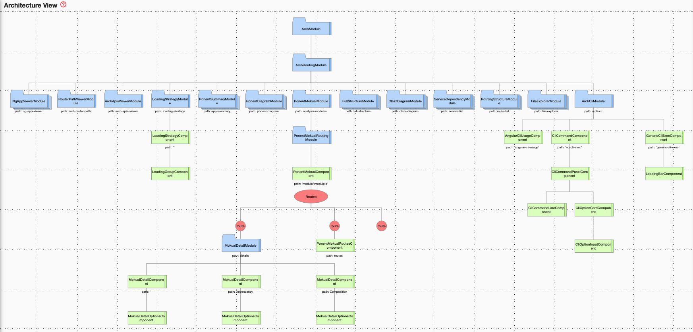
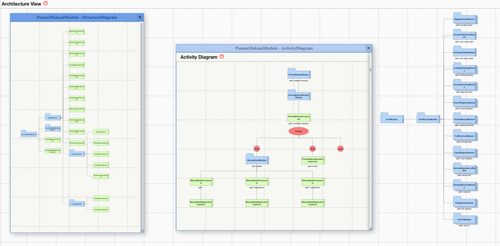

# ngArch
ngArch is an Angular application architecture tool, analyzing the static structure of the Angular application and visually displaying the modules, components, services and data models in multiple diagrams.

## Description

ngArch(Angular application architecture tool) includes the following parts and projects.

<ul>
  <li>ngArch server, called ngarch-server, is a node and express application. It parses the Typescript source code and extracts the elements of the Angular application.</li>
  <i>(To install, using 'npm install ngarch-server')</i>
  <li>ngArch application, called ngarch, is an Angular 6 application. It visually shows the elements and the structure of the application in multiple diagrams.</li>
  <i>(To install, using 'npm install ngarch')</i>
  <li>Dependency package, called ngarch-dev, is Angular project development dependency, which contains server(ngarch-server) and application(ngarch).</li>
  <i>(To install, using 'npm install ngarch-dev')</i>
</ul>

## Demo

ngArch Architecture

  

Structure Diagram

  

<a href="DEMO.md">more demos</a>

## Contributing
The project is maintained by <a href="https://github.com/samcodex">samcodex</a>

When contributing to this repository, please first discuss the change you wish to make via issue, email, or any other method with the owners of this repository before making a change.

Please note we have a code of conduct, please follow it in all your interactions with the project.

  
<a href="https://google.github.io/styleguide/jsguide.html">Google JavaScript Style Guide</a>,
  <a href="https://angular.io/guide/styleguide">Angular Style Guide</a>

### Getting started
<ol>
  <li>Fork the ngArch project</li>

    Click on the "fork" button on top to clone your own fork of the ngArch project. It contains ngArch source code and the dependencies, including ngArch-server 

  <li>Install the dependencies</li>
    
    npm install
    

  <li>Start ngArch server</li>

    npm start ngarch-server
    (using port 3000 for websocket)

    When the server is running, it first parses the current Angular project which is ngArch application itself.

  <li>Start ngArch application</li>

    npm start
    (using port 5200)

  <li>Access ngArch application in browse</li>

    http://localhost:5200

    Since ngArch is already parsed, the displaying content is the structure of ngArch itself.
    Change the analyzing project from drop down menu on the top.
</ol>

## Use ngArch as development dependency
Install ngArch as development dependency to your Angular project

<ol>
  <li>Installation</li>

    npm install ngarch-dev --save-dev

  <li>Add launch script to package.json</li>

    "scripts": {
      ...
      "ngarch": "node node_modules/ngarch-server/server",
      ...
    }

  <li>Start ngArch server</li>

    npm run ngarch
    (using port 3000 for web and websocket)

    When the server is running, it first parses the host angular project.

  <li>Access ngArch application in browse</li>

    http://localhost:3000

    The displaying content is the structure of your Angular project
</ol>

## License

MIT
